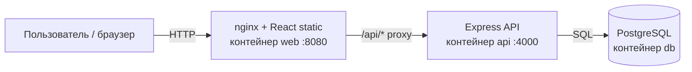
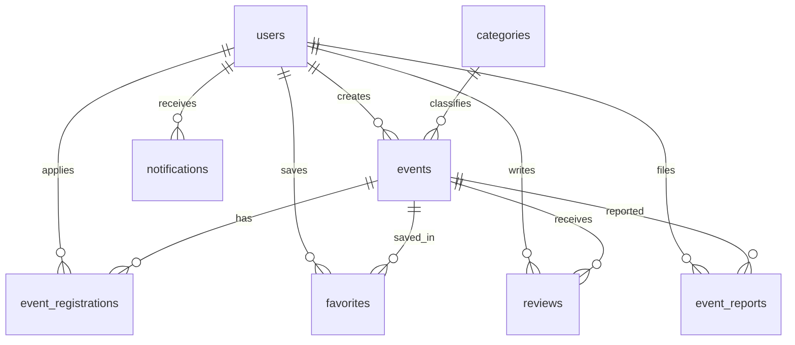

# Пояснительная записка  
## Веб-сервис «Культурный Навигатор» — агрегация городских мероприятий

> **Назначение документа:** материал для курсовой работы (МДП), отчёта, пояснительной записки и презентации.  
> Описание соответствует текущему состоянию репозитория `site_mdp`.

---

### Шаблон титульного листа (заполнить в Word)

| Поле | Значение |
|------|----------|
| Тема | Разработка веб-сервиса агрегации городских мероприятий «Культурный Навигатор» |
| Дисциплина | МДП (моделирование и проектирование программных систем) |
| Объект разработки | Веб-приложение (клиент + сервер + СУБД) |
| Язык реализации | JavaScript (Node.js, React) |
| СУБД | PostgreSQL 16 |
| Географический контекст UI | г. Кострома |

---

## Содержание

1. [Аннотация](#1-аннотация)  
2. [Введение](#2-введение)  
3. [Назначение и цели проекта](#3-назначение-и-цели-проекта)  
4. [Анализ предметной области](#4-анализ-предметной-области)  
5. [Требования к системе](#5-требования-к-системе)  
6. [Роли пользователей](#6-роли-пользователей)  
7. [Функциональные возможности (по разделам сайта)](#7-функциональные-возможности-по-разделам-сайта)  
8. [Архитектура и состав системы](#8-архитектура-и-состав-системы)  
9. [Технологический стек](#9-технологический-стек)  
10. [Структура проекта](#10-структура-проекта)  
11. [Модель данных](#11-модель-данных)  
12. [REST API](#12-rest-api)  
13. [Аутентификация и безопасность](#13-аутентификация-и-безопасность)  
14. [Пользовательский интерфейс](#14-пользовательский-интерфейс)  
15. [Развёртывание и эксплуатация](#15-развёртывание-и-эксплуатация)  
16. [Ограничения и направления развития](#16-ограничения-и-направления-развития)  
17. [Заключение](#17-заключение)  
18. [Список источников (шаблон)](#18-список-источников-шаблон)  
19. [Приложения](#19-приложения)  

---

## 1. Аннотация

**«Культурный Навигатор»** — веб-сервис для просмотра, поиска и организации городских мероприятий. Пользователь видит **ленту событий** и **интерактивную карту** (OpenStreetMap / Leaflet), фильтрует по категории, датам и типу (официальные / от жителей), добавляет события в **избранное**, **записывается** на участие с учётом лимита мест, оставляет **отзывы** после окончания. Организаторы создают мероприятия с выбором точки на карте и контактами; публикации жителей проходят **премодерацию**. Администратор управляет очередью модерации, просматривает **жалобы** и **статистику**.

Система реализована по схеме **клиент — сервер — база данных**: SPA на React, REST API на Express, PostgreSQL. Развёртывание для демонстрации — **Docker Compose** (БД + API + nginx со статикой фронтенда).

---

## 2. Введение

### 2.1. Актуальность

Информация о культурных и развлекательных событиях в городе часто распределена между социальными сетями, афишами и сайтами организаторов. Это затрудняет поиск актуальных мероприятий, оценку наличия свободных мест и связь с организатором. Единый агрегатор с картой, фильтрами и механизмом записи снижает информационный разрыв между жителями и событиями.

### 2.2. Цель работы

Спроектировать и реализовать веб-сервис агрегации городских мероприятий с поддержкой ролей, модерации, записи участников и обратной связи (отзывы, жалобы).

### 2.3. Задачи

1. Проанализировать предметную область и выделить роли.  
2. Спроектировать реляционную модель данных.  
3. Реализовать REST API с аутентификацией JWT.  
4. Разработать клиентское SPA с лентой, картой и личным кабинетом.  
5. Обеспечить премодерацию пользовательского контента.  
6. Подготовить воспроизводимое развёртывание (Docker).

### 2.4. Объект и предмет

| | |
|---|---|
| **Объект** | Процесс информирования жителей о городских мероприятиях |
| **Предмет** | Веб-приложение и его программная реализация |

---

## 3. Назначение и цели проекта

**Назначение:** предоставить жителям и гостям города единую точку доступа к афише мероприятий; организаторам — инструмент публикации и приёма заявок; администрации сервиса — контроль качества публикаций.

**Ключевые результаты для пользователя:**

- быстрый поиск событий по тексту, категории и датам;
- визуализация на карте;
- прозрачность по свободным местам;
- доверие к публикациям за счёт модерации;
- разделение официальных и community-событий.

---

## 4. Анализ предметной области

### 4.1. Участники процесса

| Участник | Интерес |
|----------|---------|
| Гость | Просмотр ленты без регистрации |
| Зарегистрированный пользователь | Запись, избранное, создание событий, отзывы |
| Организатор (тот же USER) | Управление своими событиями и заявками участников |
| Администратор | Модерация, жалобы, статистика, официальные публикации |

### 4.2. Типы мероприятий

| Тип в БД | Смысл | Модерация |
|----------|--------|-----------|
| `OFFICIAL` | Официальные / проверенные источники | При создании **админом** — сразу `APPROVED` |
| `COMMUNITY` | От жителей | По умолчанию `PENDING`, публикация после решения админа |

### 4.3. Статусы модерации события

`PENDING` → на проверке; `NEEDS_EDIT` → нужны правки; `APPROVED` → в ленте; `REJECTED` → отклонено.

### 4.4. Запись на мероприятие

Заявка хранится в `event_registrations` со статусом `PENDING` / `APPROVED` / `REJECTED`. Организатор одобряет или отклоняет; при `max_participants` сервер не даёт превысить лимит одобренных записей.

### 4.5. Конфиденциальность адреса

Поле `address_public`: если `false`, полный адрес и координаты на карте доступны только участнику с **одобренной** заявкой (логика на сервере и в UI).

---

## 5. Требования к системе

### 5.1. Функциональные требования

| ID | Требование |
|----|------------|
| F1 | Просмотр ленты одобренных мероприятий с пагинацией |
| F2 | Поиск по названию, фильтры: категория, тип, диапазон дат |
| F3 | Отображение событий на карте (при наличии координат) |
| F4 | Регистрация и вход с проверкой данных |
| F5 | Профиль пользователя (редактирование, публичный просмотр) |
| F6 | Создание, редактирование, удаление своих мероприятий |
| F7 | Выбор геоточки при создании события |
| F8 | Премодерация community-событий |
| F9 | Запись на мероприятие, управление заявками организатором |
| F10 | Избранное (гость — localStorage; пользователь — БД) |
| F11 | Отзывы (1–5 звёзд, один отзыв на событие, после окончания) |
| F12 | Жалобы на опубликованные события |
| F13 | Уведомления в интерфейсе |
| F14 | Панель администратора: очередь, статистика, жалобы |
| F15 | Светлая и тёмная тема |

### 5.2. Нефункциональные требования

| ID | Требование |
|----|------------|
| NF1 | Клиент–серверное взаимодействие по HTTP/JSON |
| NF2 | Адаптивная вёрстка (мобильные фильтры, вкладки «Список / Карта») |
| NF3 | Параметризованные SQL-запросы |
| NF4 | Валидация входных данных на сервере (Zod) |
| NF5 | Воспроизводимый запуск через Docker Compose |
| NF6 | Идемпотентная инициализация схемы БД при старте API в Docker |

---

## 6. Роли пользователей

### 6.1. Гость (без токена)

- Лента и карта, просмотр карточек и деталей (с ограничениями по адресу).  
- Избранное в `localStorage` (`cultural-navigator:guest-favorites`).  
- Тема оформления в `localStorage` (`cultural-navigator:theme`).  
- Переход на регистрацию / вход.

### 6.2. Пользователь (`USER`)

Всё, что у гостя, плюс:

- JWT в `localStorage` (`cultural-navigator:token`).  
- Создание и редактирование своих событий.  
- Запись на чужие события, отмена заявки.  
- Избранное на сервере; при первом входе — слияние с гостевым.  
- Отзывы, жалобы, уведомления, профиль.  
- Раздел «Моё»: «Я иду» / «Я организую».

### 6.3. Администратор (`ADMIN`)

Назначается при регистрации, если email указан в переменной окружения `ADMIN_EMAILS`.

- Панель модерации (`#moderation`).  
- Одобрение / правки / отклонение событий.  
- Просмотр жалоб и сводной статистики.  
- Создание `OFFICIAL` событий с немедленной публикацией.

---

## 7. Функциональные возможности (по разделам сайта)

### 7.1. Главная — лента и карта (`#feed`)

**Компоненты:** `FeedSection`, `EventFeedCard`, карта Leaflet.

| Возможность | Описание |
|-------------|----------|
| Список событий | Карточки с названием, датой, категорией, типом, организатором |
| Поиск | Строка поиска с debounce; сервер — `ILIKE` / полнотекстовый индекс GIN |
| Фильтры | Категория, тип (`OFFICIAL` / `COMMUNITY`), дата с / по |
| Пагинация | По 10 записей (`PAGE_SIZE`) |
| Карта | Маркеры для событий с координатами; центр — Кострома `[57.7679, 40.9269]` |
| Мобильная версия | Сворачиваемые фильтры; переключатель «Список / Карта» |
| FOMO-метка | На карточке — индикатор ограниченных мест (при малом остатке) |
| Избранное | Сердечко на карточке |

**API:** `GET /api/events`, `GET /api/meta/categories`.

---

### 7.2. Карточка мероприятия (`#event/<id>`)

**Компонент:** `EventDetailSection`.

| Возможность | Описание |
|-------------|----------|
| Описание | Текст, изображение, даты, категория |
| Контакты организатора | Телефон, Telegram, VK (`OrganizerContacts`) |
| Адрес / карта | Зависит от `address_public` и статуса записи |
| Запись | Модальное окно `AttendApplyModal` с сообщением организатору |
| Отмена записи | Для своей заявки |
| Отзывы | Список + форма (если событие завершено и запись одобрена) |
| Жалоба | `ReportEventModal` — только на опубликованные события |
| Ссылка на профиль организатора | `UserLink` → `#user/<id>` |

**API:** `GET /api/events/:id`, `POST/DELETE .../attend`, `GET /api/reviews/event/:id`, `POST /api/reviews`, `POST .../report`.

---

### 7.3. Регистрация и вход (`#register`, `#login`)

**Компоненты:** `RegisterPage`, `LoginPage`, `PasswordStrengthHints`, `PasswordInput`.

| Возможность | Описание |
|-------------|----------|
| Капча | `GET /api/auth/captcha` — арифметический пример, проверка на сервере |
| Проверка логина/email | `GET /api/auth/check-availability` |
| Требования к паролю | Подсказки силы пароля на клиенте |
| Поля профиля | Имя, фамилия, логин, email, пол, возраст 18+, согласие с правилами |
| Вход | По логину и паролю |
| После успеха | JWT + загрузка профиля, «Моё», синхронизация избранного |

**API:** `POST /api/auth/register`, `POST /api/auth/login`.

---

### 7.4. Профиль (`#profile`, `#profile-edit`, `#user/<id>`)

**Компоненты:** `ProfileEditSection`, `UserProfileView`.

| Возможность | Описание |
|-------------|----------|
| Свой профиль | Просмотр и редактирование: имя, био, телефон, соцсети, аватар (URL) |
| Чужой профиль | Публичные поля без чувствительных данных |
| Тема | Сохранение `light` / `dark` в БД (`users.theme`) |

**API:** `GET/PATCH /api/me/profile`, `PATCH /api/me/theme`, `GET /api/users/:userId`.

---

### 7.5. Раздел «Моё» (`#attending`, `#my-events`)

**Компонент:** `MyActivitySection` (вкладки «Я иду» / «Я организую»).

| Вкладка | Возможности |
|---------|-------------|
| **Я иду** | Список записей со статусами; переход к событию |
| **Я организую** | Свои события; участники; одобрение/отклонение заявок; **исключение** участника |

**API:** `GET /api/me/attending-events`, `GET /api/me/created-events`, `GET /api/events/:id/participants`, `PATCH .../registrations/:userId`, `DELETE .../registrations/:userId`.

---

### 7.6. Избранное (`#favorites`)

**Компонент:** `FavoritesSection` — сетка карточек.

- Гость: ID в `localStorage`, подгрузка событий по API при наличии.  
- Пользователь: `GET/POST/DELETE /api/favorites`.

---

### 7.7. Создание и редактирование события (`#create-event`)

**Компоненты:** `EventFormSection`, `EventPointPicker`.

| Поле / действие | Описание |
|-----------------|----------|
| Название, описание | Текст |
| Категория | Из справочника |
| Тип | OFFICIAL / COMMUNITY |
| Даты начала и окончания | С проверкой `starts_at < ends_at` |
| Адрес | Текст + флаг «показывать всем» |
| Координаты | Клик по карте или геокодинг (`GET /api/meta/geocode`) |
| Изображение | URL |
| Лимит участников | Опционально |
| Контакты организатора | Подставляются из профиля |
| Редактирование | Только автор; при `NEEDS_EDIT` — повторная отправка |

**API:** `POST /api/events`, `PATCH /api/events/:id`, `DELETE /api/events/:id`.

---

### 7.8. Панель модерации (`#moderation`, только ADMIN)

**Компоненты:** `ModerationPanel`, `AdminStatsBar`.

| Блок | Описание |
|------|----------|
| Статистика | Количество пользователей, событий, на модерации, жалоб |
| Очередь | Фильтр по статусу; карточка события; комментарий модератора |
| Действия | Одобрить / на правки / отклонить |
| Жалобы | Список `event_reports` с событием и автором жалобы |

**API:** `GET /api/admin/stats`, `GET /api/admin/events/moderation-queue`, `PATCH /api/admin/events/:id/moderation`, `GET /api/admin/reports`.

---

### 7.9. Уведомления

**Компонент:** `NotificationBell` в шапке.

| Тип (`notifications.type`) | Когда создаётся |
|----------------------------|-----------------|
| `MODERATION_APPROVED` / `NEEDS_EDIT` / `REJECTED` | Решение модератора |
| `REGISTRATION_REQUEST` | Новая заявка организатору |
| `REGISTRATION_APPROVED` / `REJECTED` | Решение по заявке |
| `REGISTRATION_REMOVED` | Исключение участника |
| `EVENT_REMINDER` | За день до начала (для одобренных записей) |

**API:** `GET /api/notifications`, `PATCH /api/notifications/:id/read`, `PATCH /api/notifications/read-all`.

---

### 7.10. Общие элементы интерфейса

| Элемент | Назначение |
|---------|------------|
| `AppHeader` | Навигация, «+ Создать», избранное, уведомления, тема, профиль |
| `AppFooter` | Подвал; компактный режим на ленте |
| `ThemeToggle` | Светлая / тёмная тема |
| `SiteLogo` | Брендинг «Культурный Навигатор» |
| Toast-уведомления | Ошибки и успех операций |
| Индикатор API offline | Если `GET /health` недоступен |

---

## 8. Архитектура и состав системы

### 8.1. Логические уровни

```
┌──────────────────────────────────────────────────────────────────┐
│  Уровень представления (Presentation)                             │
│  React SPA, Tailwind, Leaflet — браузер пользователя              │
└────────────────────────────┬─────────────────────────────────────┘
                             │ HTTP/JSON, REST
┌────────────────────────────▼─────────────────────────────────────┐
│  Уровень приложения (Application / Business Logic)                │
│  Express: маршруты, JWT, Zod, правила модерации и записи          │
└────────────────────────────┬─────────────────────────────────────┘
                             │ SQL (pg)
┌────────────────────────────▼─────────────────────────────────────┐
│  Уровень данных (Data)                                            │
│  PostgreSQL: users, events, registrations, favorites, reviews...  │
└──────────────────────────────────────────────────────────────────┘
```

### 8.2. Развёртывание в Docker

```
Браузер → http://localhost:8080 (контейнер web, nginx)
              ├── /              → статика React (Vite build)
              └── /api/*         → proxy → контейнер api:4000
                                          └── контейнер db (PostgreSQL)
```

Файл `client/nginx.conf` объединяет фронт и API на одном origin — в production не нужен CORS между портами.

### 8.3. Monorepo

Корневой `package.json` с **npm workspaces**: пакеты `client/` и `server/`. Одна установка зависимостей: `npm install` в корне.

### 8.4. Поток данных (пример: запись на событие)

1. Пользователь нажимает «Записаться» → `POST /api/events/:id/attend` с JWT.  
2. `requireAuth` → `validate` → проверка лимита, дубликата, «не свой event».  
3. `INSERT` в `event_registrations` (`PENDING`).  
4. `createNotification` организатору.  
5. JSON-ответ → клиент обновляет состояние и показывает toast.

---

## 9. Технологический стек

### 9.1. Клиент (`client/`)

| Технология | Версия (ориентир) | Применение |
|------------|-------------------|------------|
| React | 18.3 | UI, компоненты, хуки |
| Vite | 5.4 | Сборка, dev-сервер |
| Tailwind CSS | 3.4 | Стили, тёмная тема (`darkMode: 'class'`) |
| Leaflet / react-leaflet | 1.9 / 4.2 | Карта OSM |

**Навигация:** hash-роутинг (`#feed`, `#event/uuid`, …) без React Router — состояние `page` в `App.jsx`.

### 9.2. Сервер (`server/`)

| Технология | Применение |
|------------|------------|
| Node.js | Среда выполнения |
| Express 4 | HTTP, маршруты, middleware |
| pg | Пул соединений PostgreSQL |
| jsonwebtoken | JWT после login/register |
| bcryptjs | Хеш паролей |
| Zod | Валидация запросов |
| cors, dotenv | Dev и конфигурация |

### 9.3. Инфраструктура

| Компонент | Назначение |
|-----------|------------|
| PostgreSQL 16 | Хранение данных |
| Docker Compose | `db`, `api`, `web` |
| nginx (в образе web) | Статика + reverse proxy `/api` |

---

## 10. Структура проекта

```
site_mdp/
├── client/                      # Фронтенд
│   ├── src/
│   │   ├── App.jsx              # Состояние, навигация, оркестрация API
│   │   ├── api.js               # Все HTTP-запросы
│   │   ├── constants.js         # Страницы, ключи storage, центр карты
│   │   ├── theme.js             # Тема оформления
│   │   ├── utils.js             # Валидация форм, статусы
│   │   ├── components/          # 26 UI-компонентов
│   │   └── validation/          # Клиентская валидация auth-форм
│   ├── nginx.conf
│   └── Dockerfile
├── server/
│   ├── src/
│   │   ├── app.js               # Регистрация маршрутов
│   │   ├── server.js            # Запуск
│   │   ├── routes/              # auth, events, admin, me, favorites...
│   │   ├── middleware/          # auth, validate, error-handler
│   │   ├── schemas/             # Zod-схемы
│   │   └── utils/               # notifications, captcha, SQL-хелперы
│   ├── docker-entrypoint.sh     # schema.sql + seed.sql
│   └── Dockerfile
├── db/
│   ├── schema.sql               # Таблицы, ENUM, индексы
│   └── seed.sql                 # Категории
├── docker-compose.yml
├── docs/                        # Документация
└── README.md
```

---

## 11. Модель данных

### 11.1. ER-описание (словесно)

- **users** 1—N **events** (создатель `created_by`)  
- **categories** 1—N **events**  
- **users** N—M **events** через **favorites**  
- **users** N—M **events** через **event_registrations** (атрибуты: `status`, `message`)  
- **users** 1—N **reviews** на событие (уникальная пара user+event)  
- **users** 1—N **notifications**  
- **users** N—M **events** через **event_reports** (жалоба, одна на пару)

### 11.2. Таблицы

| Таблица | Назначение |
|---------|------------|
| `users` | Учётная запись, профиль, роль, тема |
| `categories` | Справочник рубрик |
| `events` | Мероприятие: контент, геоданные, модерация, лимит мест |
| `event_registrations` | Заявки на участие |
| `favorites` | Избранное |
| `reviews` | Отзывы (rating 1–5) |
| `notifications` | Уведомления |
| `event_reports` | Жалобы |

### 11.3. Перечисления (ENUM)

| Тип | Значения |
|-----|----------|
| `user_role` | USER, ADMIN |
| `event_type` | OFFICIAL, COMMUNITY |
| `moderation_status` | PENDING, NEEDS_EDIT, APPROVED, REJECTED |
| `registration_status` | PENDING, APPROVED, REJECTED |
| `user_gender` | MALE, FEMALE |

### 11.4. Категории (seed)

1. Кино & Театр  
2. Концерты & Вечеринки  
3. Лекции & Воркшопы  
4. Спорт & Активный отдых  
5. Выставки & Арт  
6. Квизы & Настолки  
7. Ламповые тусовки  

### 11.5. Индексы (выборочно)

- `idx_events_public_filters` — лента по статусу, дате, категории  
- `idx_events_title_search` — GIN полнотекстовый поиск по названию  
- `idx_notifications_user`, `idx_notifications_unread`  
- `idx_event_registrations_event`, `idx_reviews_event`  

Схема **идемпотентна**: при старте API в Docker выполняются `schema.sql` и `seed.sql` (без отдельного Flyway).

---

## 12. REST API

Базовый префикс: `/api`. Проверка жизни: `GET /health` → `{ "ok": true }`.

### 12.1. Аутентификация (`/api/auth`)

| Метод | Путь | Доступ | Описание |
|-------|------|--------|----------|
| GET | `/captcha` | Публичный | Капча для регистрации |
| GET | `/check-availability` | Публичный | Свободен ли login/email |
| POST | `/register` | Публичный | Регистрация → JWT + user |
| POST | `/login` | Публичный | Вход → JWT + user |
| GET | `/me` | JWT | Текущий пользователь |

### 12.2. Мероприятия (`/api/events`)

| Метод | Путь | Доступ | Описание |
|-------|------|--------|----------|
| GET | `/` | Публичный | Лента (только APPROVED), фильтры, page/limit |
| GET | `/:id` | optionalAuth | Детали |
| POST | `/` | JWT | Создание |
| PATCH | `/:id` | JWT | Редактирование (автор) |
| DELETE | `/:id` | JWT | Удаление (автор) |
| POST | `/:id/attend` | JWT | Заявка на участие |
| DELETE | `/:id/attend` | JWT | Отмена своей заявки |
| GET | `/:id/participants` | JWT | Участники (организатор) |
| GET | `/:id/attendees` | JWT | Список для организатора |
| PATCH | `/:id/registrations/:userId` | JWT | Одобрить/отклонить |
| DELETE | `/:id/registrations/:userId` | JWT | Исключить участника |
| POST | `/:id/report` | JWT | Жалоба |

### 12.3. Профиль (`/api/me`, все с JWT)

| Метод | Путь | Описание |
|-------|------|----------|
| GET | `/profile` | Профиль |
| PATCH | `/profile` | Обновление |
| PATCH | `/theme` | `light` / `dark` |
| GET | `/created-events` | Мои события |
| GET | `/attending-events` | Куда записан |

### 12.4. Прочие

| Группа | Основные пути |
|--------|----------------|
| `/api/favorites` | GET, POST, DELETE `/:eventId` |
| `/api/reviews` | GET `/event/:eventId`, POST `/` |
| `/api/notifications` | GET, PATCH read |
| `/api/meta` | GET `/categories`, GET `/geocode` |
| `/api/users` | GET `/:userId` (публичный профиль) |
| `/api/admin` | stats, moderation-queue, moderation PATCH, reports |

Заголовок авторизации: `Authorization: Bearer <JWT>`.

---

## 13. Аутентификация и безопасность

### 13.1. JWT

| Параметр | Значение |
|----------|----------|
| Выдача | `POST /login`, `POST /register` |
| Payload | `sub` (id), `role`, `email`, `login` |
| Срок | **1 сутки** (`expiresIn: "1d"`) |
| Секрет | `JWT_SECRET` в `server/.env` |
| Хранение на клиенте | `localStorage`, ключ `cultural-navigator:token` |
| Передача | Заголовок `Authorization: Bearer ...` |
| Проверка | `server/src/middleware/auth.js` → `jwt.verify` |

**При истечении срока:** сервер отвечает **401** (`Invalid or expired token`); защищённые действия недоступны; пользователю нужен повторный вход. Refresh-токен **не реализован**; автоматический logout при 401 **не реализован** (токен может остаться в storage до ручного выхода).

### 13.2. Пароли

- Хеширование **bcrypt** (cost 10), в БД только `password_hash`.  
- При входе — `bcrypt.compare`, пароль в открытом виде не хранится.

### 13.3. Прочие меры

| Мера | Реализация |
|------|------------|
| SQL-инъекции | Параметры `$1, $2` в запросах `pg` |
| Валидация | Zod на сервере; дублирование части правил на клиенте |
| Права | Проверка `created_by`, `requireAdmin` |
| Капча | In-memory store при регистрации |
| CORS | В dev между :5173 и :4000; в Docker — один origin |

**Не реализовано (для честного описания в отчёте):** OAuth, rate limiting, refresh JWT, HTTPS в локальном Docker.

---

## 14. Пользовательский интерфейс

### 14.1. Дизайн-система

- Основной акцент: **indigo** (кнопки, ссылки, активные состояния).  
- Скругления `rounded-2xl`, карточки с тенью.  
- **Тёмная тема:** класс `dark` на `<html>`, утилиты Tailwind `dark:...`, общие классы в `styles.css`.

### 14.2. Навигация (hash)

| URL hash | Экран |
|----------|--------|
| `#feed` | Лента + карта |
| `#event/<uuid>` | Мероприятие |
| `#login`, `#register` | Вход / регистрация |
| `#profile`, `#profile-edit` | Профиль |
| `#user/<uuid>` | Чужой профиль |
| `#attending`, `#my-events` | Моё |
| `#favorites` | Избранное |
| `#create-event` | Форма события |
| `#moderation` | Админ-панель |

### 14.3. Локальное хранилище браузера

| Ключ | Данные |
|------|--------|
| `cultural-navigator:token` | JWT |
| `cultural-navigator:guest-favorites` | ID избранного гостя |
| `cultural-navigator:theme` | Тема (гость и до синхронизации с БД) |

---

## 15. Развёртывание и эксплуатация

### 15.1. Docker (рекомендуется для демо)

```bash
docker compose up --build
```

- Сайт: http://localhost:8080  
- Health: http://localhost:8080/health  

Переменные (`.env` из `.env.docker.example`):

| Переменная | Назначение |
|------------|------------|
| `JWT_SECRET` | Подпись JWT |
| `ADMIN_EMAILS` | Email админа при регистрации |
| `WEB_PORT` | Порт сайта (по умолчанию 8080) |

Команды: `docker compose down`, `docker compose down -v` (сброс БД), `docker compose logs -f api`.

### 15.2. Локальная разработка

1. PostgreSQL, база `cultural_navigator`.  
2. `server/.env` из `.env.example`.  
3. `npm install` → `npm run db:migrate` → `npm --workspace server run db:seed`.  
4. `npm run dev:server` (порт 4000), `npm run dev:client` (порт 5173).  
5. Опционально `client/.env`: `VITE_API_URL=http://localhost:4000/api`.

### 15.3. Сборка фронтенда

```bash
cd client && npm run build
```

Артефакт в `client/dist/` — раздаётся nginx в Docker.

---

## 16. Ограничения и направления развития

| Ограничение | Возможное развитие |
|-------------|-------------------|
| SPA без SSR | Next.js / SSR для SEO |
| Нет refresh-токена | Пара access + refresh, авто-продление сессии |
| Состояние в одном `App.jsx` | Context API / Zustand |
| Нет ORM | Prisma / TypeORM |
| Геокодинг зависит от внешнего API | Собственный справочник адресов |
| Нет rate limit | express-rate-limit |
| JWT 1 день | Настраиваемый TTL, logout при 401 |

---

## 17. Заключение

В рамках курсового проекта разработан полнофункциональный веб-сервис **«Культурный Навигатор»**, закрывающий задачи агрегации мероприятий, визуализации на карте, записи участников с лимитом мест, модерации пользовательского контента и обратной связи (отзывы, жалобы, уведомления). Применена классическая трёхзвенная архитектура на стеке **React + Express + PostgreSQL** с контейнеризацией **Docker Compose**, что обеспечивает воспроизводимую демонстрацию на защите.

---

## 18. Список источников (шаблон)

1. Документация React — https://react.dev/  
2. Документация Express — https://expressjs.com/  
3. Документация PostgreSQL — https://www.postgresql.org/docs/  
4. Leaflet — https://leafletjs.com/  
5. JWT (RFC 7519) — https://datatracker.ietf.org/doc/html/rfc7519  
6. OpenStreetMap — https://www.openstreetmap.org/  
7. Tailwind CSS — https://tailwindcss.com/docs  
8. Docker Documentation — https://docs.docker.com/  

*Дополните учебниками и методичками по дисциплине МДП по указанию преподавателя.*

---

## 19. Приложения

### Приложение А. Соответствие разделов отчёта и документации

| Раздел типового отчёта | Где взять текст |
|------------------------|-----------------|
| Введение, актуальность | §2, §4 |
| Постановка задачи | §3, §5 |
| Анализ предметной области | §4, §6 |
| Проектирование | §8, §11 |
| Реализация | §9, §10, §12 |
| Руководство пользователя | §7, §14 |
| Тестирование / демо | [PODGOTOVKA_K_ZASHCHITE.md](PODGOTOVKA_K_ZASHCHITE.md) §14 |
| Защита, Q&A | [PODGOTOVKA_K_ZASHCHITE.md](PODGOTOVKA_K_ZASHCHITE.md) §15 |

### Приложение Б. Диаграмма развёртывания (Mermaid)



### Приложение В. Диаграмма сущностей (упрощённо)



### Приложение Г. Ключевые файлы исходного кода

| Файл | Содержание |
|------|------------|
| `client/src/App.jsx` | Навигация, состояние, сценарии |
| `client/src/api.js` | HTTP-клиент |
| `server/src/routes/events.js` | Лента, CRUD, запись, жалобы |
| `server/src/routes/auth.js` | Регистрация, JWT |
| `server/src/middleware/auth.js` | JWT middleware |
| `db/schema.sql` | Модель данных |

---

*Документ актуален для репозитория «Культурный Навигатор» (курсовой проект МДП). Для вопросов на защите см. [PODGOTOVKA_K_ZASHCHITE.md](PODGOTOVKA_K_ZASHCHITE.md).*
